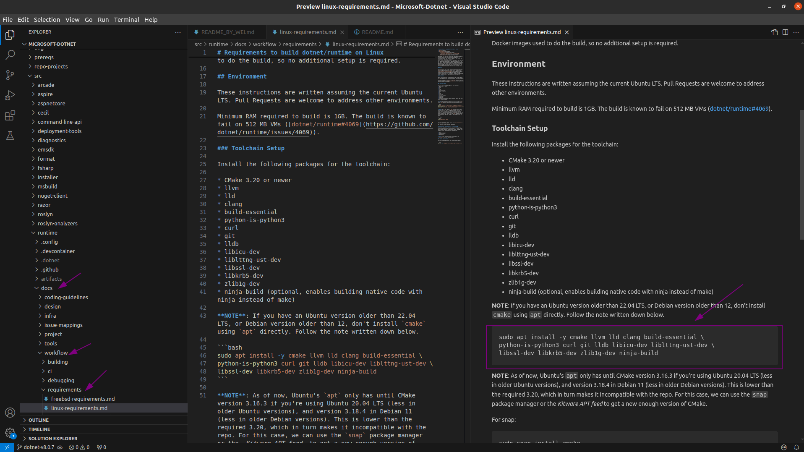
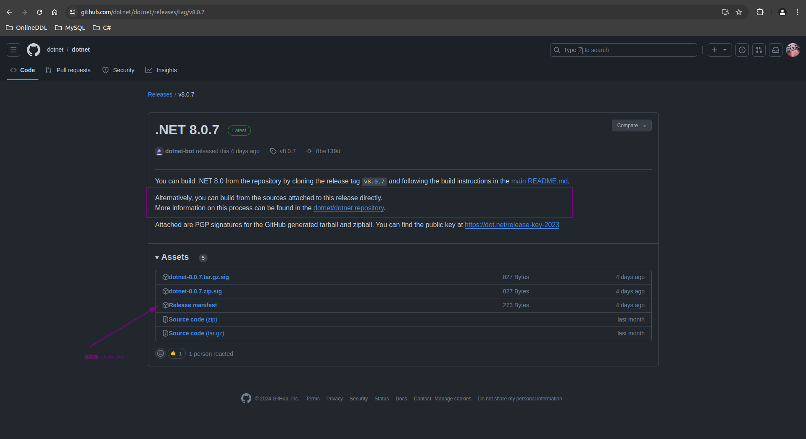
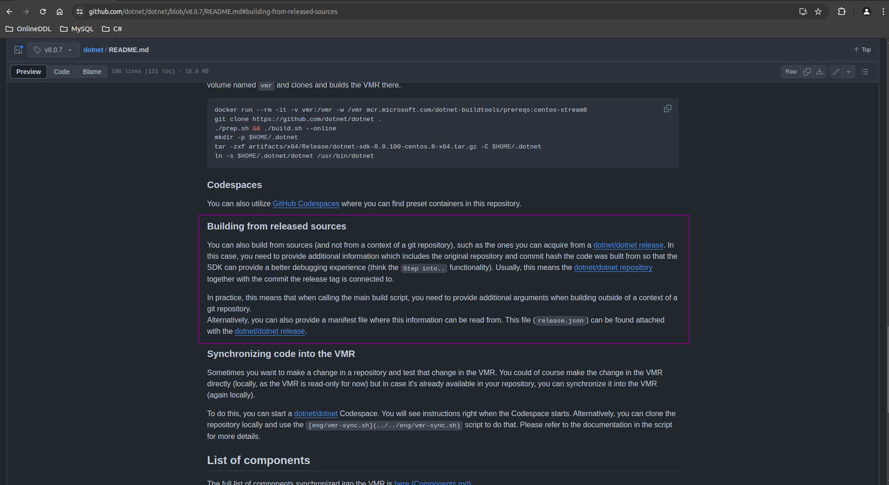
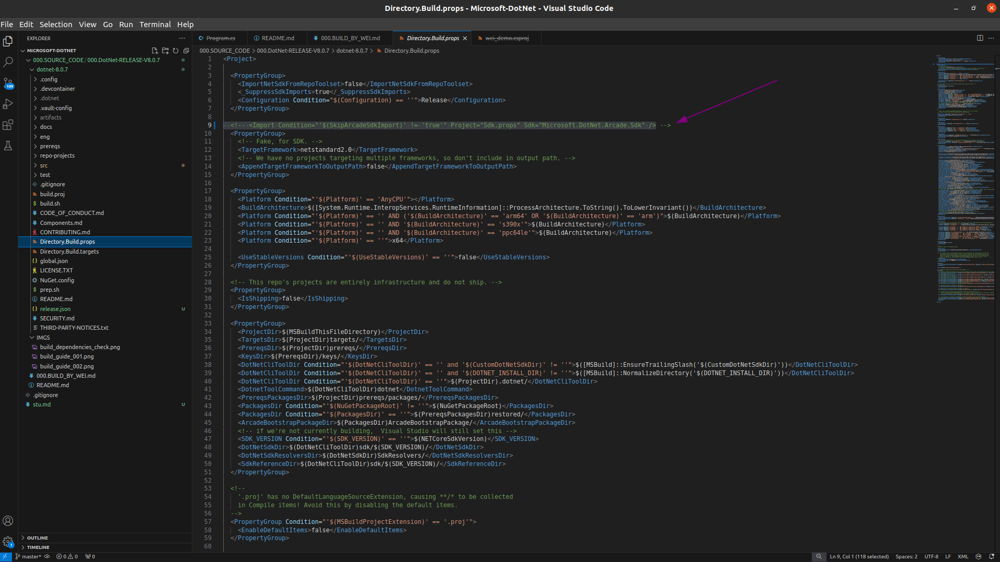
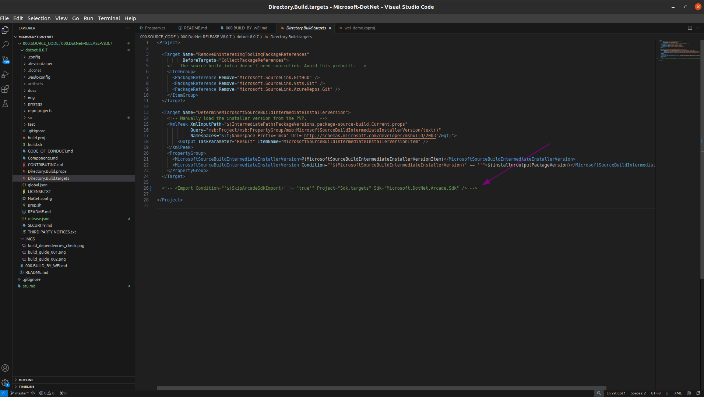

# dotnet/dotnet - Home of the .NET VMR


## 编译dotnet
### 依赖安装

> 按照这样的规则，将每个组件所需要的依赖安装好

### 编译
按照[README.md](./README.md)文档所描述的来就OK了
> 使用发布版本代码编译，编译命令: ./build.sh --clean-while-building  --release-manifest  release.json

- 

- 


### 执行
#### The SDK 'Microsoft.DotNet.Arcade.Sdk' specified could not be found
```txt
  wei@Berries-Wang:~/WorkSpace/Open_Source/Microsoft-DotNet/000.SOURCE_CODE/000.DotNet-RELEASE-V8.0.7/dotnet-8.0.7/artifacts/x64/Release/wei-sdk$ ./dotnet  new console -o wei_demo
  The template "Console App" was created successfully.
  
  Processing post-creation actions...
  Restoring /home/wei/WorkSpace/Open_Source/Microsoft-DotNet/000.SOURCE_CODE/000.DotNet-RELEASE-V8.0.7/dotnet-8.0.7/artifacts/x64/Release/wei-sdk/wei_demo/wei_demo.csproj:
  /home/wei/WorkSpace/Open_Source/Microsoft-DotNet/000.SOURCE_CODE/000.DotNet-RELEASE-V8.0.7/dotnet-8.0.7/Directory.Build.props(9,3): error : Could not resolve SDK "Microsoft.DotNet.Arcade.Sdk". Exactly one of the probing messages below indicates why we could not resolve the SDK. Investigate and resolve that message to correctly specify the SDK.
  /home/wei/WorkSpace/Open_Source/Microsoft-DotNet/000.SOURCE_CODE/000.DotNet-RELEASE-V8.0.7/dotnet-8.0.7/Directory.Build.props(9,3): error :   SDK resolver "Microsoft.DotNet.MSBuildWorkloadSdkResolver" returned null.
  /home/wei/WorkSpace/Open_Source/Microsoft-DotNet/000.SOURCE_CODE/000.DotNet-RELEASE-V8.0.7/dotnet-8.0.7/Directory.Build.props(9,3): error :   Unable to find package Microsoft.DotNet.Arcade.Sdk. No packages exist with this id in source(s): dotnet-public
  /home/wei/WorkSpace/Open_Source/Microsoft-DotNet/000.SOURCE_CODE/000.DotNet-RELEASE-V8.0.7/dotnet-8.0.7/Directory.Build.props(9,3): error :   MSB4276: The default SDK resolver failed to resolve SDK "Microsoft.DotNet.Arcade.Sdk" because directory "/home/wei/WorkSpace/Open_Source/Microsoft-DotNet/000.SOURCE_CODE/000.DotNet-RELEASE-V8.0.7/dotnet-8.0.7/artifacts/x64/Release/wei-sdk/sdk/8.0.107/Sdks/Microsoft.DotNet.Arcade.Sdk/Sdk" did not exist.
  /home/wei/WorkSpace/Open_Source/Microsoft-DotNet/000.SOURCE_CODE/000.DotNet-RELEASE-V8.0.7/dotnet-8.0.7/Directory.Build.props(9,78): error MSB4236: The SDK 'Microsoft.DotNet.Arcade.Sdk' specified could not be found. [/home/wei/WorkSpace/Open_Source/Microsoft-DotNet/000.SOURCE_CODE/000.DotNet-RELEASE-V8.0.7/dotnet-8.0.7/artifacts/x64/Release/wei-sdk/wei_demo/wei_demo.csproj]
  Restore failed.
  Post action failed.
  Manual instructions: Run 'dotnet restore'
```

##### 解决: 注释掉一下两行代码
> 再次编译时，是否需要将这两行代码取消注释待测试
1. 

2. 
