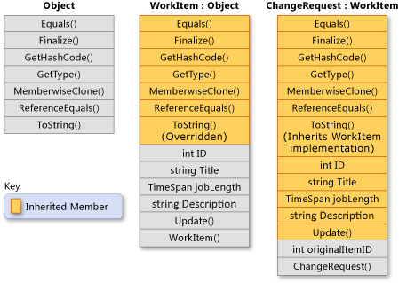

# Inheritance (继承)
Inheritance, together with encapsulation and polymorphism, is one of the three primary characteristics of object-oriented programming. Inheritance enables you to create new classes that reuse, extend, and modify the behavior defined in other classes. The class whose members are inherited is called the base class, and the class that inherits those members is called the derived class. A derived class can have only one direct base class. However, inheritance is transitive. If ClassC is derived from ClassB, and ClassB is derived from ClassA, ClassC inherits the members declared in ClassB and ClassA.(继承、封装和多态性是面向对象编程的三个主要特征之一。继承使您能够创建重用、扩展和修改在其他类中定义的行为的新类。继承其成员的类称为基类，继承这些成员的类称为派生类。派生类只能有一个直接基类。然而，继承是可传递的。如果ClassC从ClassB派生，而ClassB从ClassA派生，则ClassC继承在ClassB和ClassA中声明的成员。)

When you define a class to derive from another class, the derived class implicitly gains all the members of the base class, except for its constructors and finalizers. The derived class reuses the code in the base class without having to reimplement it. You can add more members in the derived class. The derived class extends the functionality of the base class.(当定义要从另一个类派生的类时，派生类隐式地获得基类的所有成员，但构造函数和终结器除外。派生类重用基类中的代码，而不必重新实现它。可以在派生类中添加更多成员。派生类扩展基类的功能。)

The following illustration shows a class WorkItem that represents an item of work in some business process. Like all classes, it derives from System.Object and inherits all its methods. WorkItem adds six members of its own. These members include a constructor, because constructors aren't inherited. Class ChangeRequest inherits from WorkItem and represents a particular kind of work item. ChangeRequest adds two more members to the members that it inherits from WorkItem and from Object. It must add its own constructor, and it also adds originalItemID. Property originalItemID enables the ChangeRequest instance to be associated with the original WorkItem to which the change request applies.(下面的插图显示了一个类WorkItem，它表示某个业务流程中的工作项。像所有类一样，它派生自System.Object 并继承其所有方法。WorkItem添加它自己的六个成员。这些成员包括一个构造函数，因为构造函数不能被继承。类ChangeRequest继承自WorkItem，并表示一种特定类型的工作项。ChangeRequest向它从WorkItem和Object继承的成员中添加了另外两个成员。它必须添加自己的构造函数，并且还添加了originalItemID。属性originalItemID使ChangeRequest实例能够与变更请求应用的原始工作项相关联。)


The following example shows how the class relationships demonstrated in the previous illustration are expressed in C#. The example also shows how WorkItem overrides the virtual method Object.ToString, and how the ChangeRequest class inherits the WorkItem implementation of the method. The first block defines the classes:(下面的示例展示了如何在c#中表达前面插图中演示的类关系。该示例还显示了WorkItem如何覆盖虚拟方法Object.ToString，以及ChangeRequest类如何继承该方法的WorkItem实现。第一个块定义了类:)
```C#
// WorkItem implicitly inherits from the Object class.
public class WorkItem
{
    // Static field currentID stores the job ID of the last WorkItem that
    // has been created.
    private static int currentID;

    //Properties.
    protected int ID { get; set; }
    protected string Title { get; set; }
    protected string Description { get; set; }
    protected TimeSpan jobLength { get; set; }

    // Default constructor. If a derived class does not invoke a base-
    // class constructor explicitly, the default constructor is called
    // implicitly.
    public WorkItem()
    {
        ID = 0;
        Title = "Default title";
        Description = "Default description.";
        jobLength = new TimeSpan();
    }

    // Instance constructor that has three parameters.
    public WorkItem(string title, string desc, TimeSpan joblen)
    {
        this.ID = GetNextID();
        this.Title = title;
        this.Description = desc;
        this.jobLength = joblen;
    }

    // Static constructor to initialize the static member, currentID. This
    // constructor is called one time, automatically, before any instance
    // of WorkItem or ChangeRequest is created, or currentID is referenced.
    static WorkItem() => currentID = 0;

    // currentID is a static field. It is incremented each time a new
    // instance of WorkItem is created.
    protected int GetNextID() => ++currentID;

    // Method Update enables you to update the title and job length of an
    // existing WorkItem object.
    public void Update(string title, TimeSpan joblen)
    {
        this.Title = title;
        this.jobLength = joblen;
    }

    // Virtual method override of the ToString method that is inherited
    // from System.Object.
    public override string ToString() =>
        $"{this.ID} - {this.Title}";
}

// ChangeRequest derives from WorkItem and adds a property (originalItemID)
// and two constructors.
public class ChangeRequest : WorkItem
{
    protected int originalItemID { get; set; }

    // Constructors. Because neither constructor calls a base-class
    // constructor explicitly, the default constructor in the base class
    // is called implicitly. The base class must contain a default
    // constructor.

    // Default constructor for the derived class.
    public ChangeRequest() { }

    // Instance constructor that has four parameters.
    public ChangeRequest(string title, string desc, TimeSpan jobLen,
                         int originalID)
    {
        // The following properties and the GetNexID method are inherited
        // from WorkItem.
        this.ID = GetNextID();
        this.Title = title;
        this.Description = desc;
        this.jobLength = jobLen;

        // Property originalItemID is a member of ChangeRequest, but not
        // of WorkItem.
        this.originalItemID = originalID;
    }
}
```

This next block shows how to use the base and derived classes:
```C#

// Create an instance of WorkItem by using the constructor in the
// base class that takes three arguments.
WorkItem item = new WorkItem("Fix Bugs",
                            "Fix all bugs in my code branch",
                            new TimeSpan(3, 4, 0, 0));

// Create an instance of ChangeRequest by using the constructor in
// the derived class that takes four arguments.
ChangeRequest change = new ChangeRequest("Change Base Class Design",
                                        "Add members to the class",
                                        new TimeSpan(4, 0, 0),
                                        1);

// Use the ToString method defined in WorkItem.
Console.WriteLine(item.ToString());

// Use the inherited Update method to change the title of the
// ChangeRequest object.
change.Update("Change the Design of the Base Class",
    new TimeSpan(4, 0, 0));

// ChangeRequest inherits WorkItem's override of ToString.
Console.WriteLine(change.ToString());
/* Output:
    1 - Fix Bugs
    2 - Change the Design of the Base Class
*/

```

## Abstract and virtual methods
When a base class declares a method as virtual, a derived class can override the method with its own implementation. If a base class declares a member as abstract, that method must be overridden in any non-abstract class that directly inherits from that class. If a derived class is itself abstract, it inherits abstract members without implementing them. Abstract and virtual members are the basis for polymorphism, which is the second primary characteristic of object-oriented programming. For more information, see Polymorphism.(当基类将方法声明为虚方法时，派生类可以用自己的实现覆盖该方法。如果基类将成员声明为抽象，则必须在直接继承该类的任何非抽象类中重写该方法。如果派生类本身是抽象的，则继承抽象成员而不实现它们。抽象成员和虚成员是多态的基础，多态是面向对象编程的第二个主要特征。有关更多信息，请参见多态性。)


## Abstract base classes
You can declare a class as abstract if you want to prevent direct instantiation by using the new operator. An abstract class can be used only if a new class is derived from it. An abstract class can contain one or more method signatures that themselves are declared as abstract. These signatures specify the parameters and return value but have no implementation (method body). An abstract class doesn't have to contain abstract members; however, if a class does contain an abstract member, the class itself must be declared as abstract. Derived classes that aren't abstract themselves must provide the implementation for any abstract methods from an abstract base class.(如果希望通过使用new操作符来防止直接实例化，可以将类声明为抽象类。抽象类只有在派生出新类时才能使用。抽象类可以包含一个或多个本身被声明为抽象的方法签名。这些签名指定参数和返回值，但没有实现(方法体)。抽象类不必包含抽象成员;但是，如果类确实包含抽象成员，则必须将类本身声明为抽象。本身不是抽象的派生类必须为来自抽象基类的任何抽象方法提供实现。)
```C#
   1. 抽象成员 是什么意思

```

## Interfaces
An interface is a reference type that defines a set of members. All classes and structs that implement that interface must implement that set of members. An interface may define a default implementation for any or all of these members. A class can implement multiple interfaces even though it can derive from only a single direct base class.(接口是定义一组成员的引用类型。所有实现该接口的类和结构都必须实现该成员集。接口可以为任何或所有这些成员定义默认实现。一个类可以实现多个接口，即使它只能从一个直接基类派生。)

Interfaces are used to define specific capabilities for classes that don't necessarily have an "is a" relationship. For example, the System.IEquatable\<T\> interface can be implemented by any class or struct to determine whether two objects of the type are equivalent (however the type defines equivalence). IEquatable\<T\> doesn't imply the same kind of "is a" relationship that exists between a base class and a derived class (for example, a Mammal is an Animal). For more information, see Interfaces.


## Preventing further derivation
A class can prevent other classes from inheriting from it, or from any of its members, by declaring itself or the member as sealed.(一个类可以通过将自己或成员声明为密封来防止其他类从它或它的任何成员继承。)
```C#
  
```

## Derived class hiding of base class members
A derived class can hide base class members by declaring members with the same name and signature. The new modifier can be used to explicitly indicate that the member isn't intended to be an override of the base member. The use of new isn't required, but a compiler warning will be generated if new isn't used. For more information, see Versioning with the Override and New Keywords and Knowing When to Use Override and New Keywords.(派生类可以通过声明具有相同名称和签名的成员来隐藏基类成员。新的修饰符可用于显式地指示成员不打算作为基成员的重写。不需要使用new，但如果不使用new，将生成一个编译器警告。有关详细信息，请参见使用覆盖和新关键字进行版本控制和了解何时使用覆盖和新关键字。)

---

## 参考资料
1. [https://learn.microsoft.com/en-us/dotnet/csharp/fundamentals/object-oriented/inheritance](https://learn.microsoft.com/en-us/dotnet/csharp/fundamentals/object-oriented/inheritance)